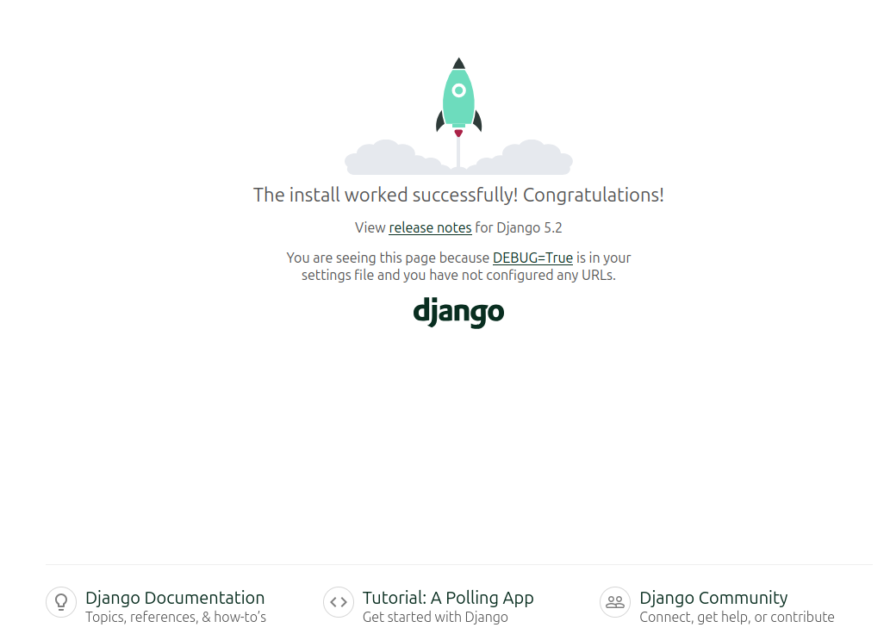
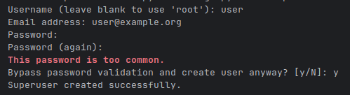
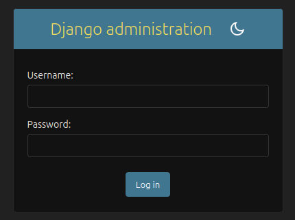
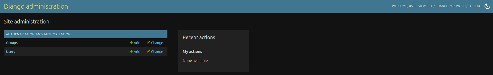

[За основу взята статья с официального сайта Django framework](https://learndjango.com/tutorials/django-docker-and-postgresql-tutorial)

Копируем из репозитория проект

`git clone git@github.com:dmitrym-web/django-docker.git`

Переходим в директорию проекта.

`cd django-docker`

Используем утилиту make, чтобы управлять проектом. Собираем образы приложения.

`make build`

Запускаем проект.

`make up`

Переходим по ссылке.

http://127.0.0.1:8000/

Если вы видете главную страницу, как на изображении, все работает.

Запускам миграции.

`make migrate`

Создаем суперпользователя.

`make createsuperuser`

Переходим по ссылке в админку

http://127.0.0.1:8000/admin/

Вводим имя и пароль, попадаем в панель управления.

